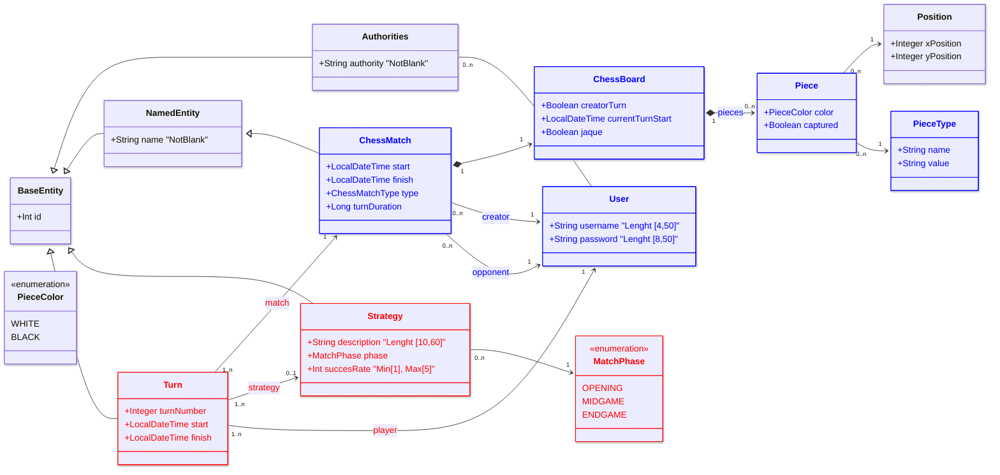

```mermaid
---
config:
  layout: dagre
  look: neo
---
classDiagram
direction LR
    class BaseEntity {
	    +Int id
    }
    class Authorities {
	    +String authority  "NotBlank"
    }
    class User {
	    +String username "Lenght [4,50]"
	    +String password "Lenght [8,50]"
    }
    class NamedEntity {
	    +String name "NotBlank"
    }
    class Strategy {
	    +String description "Lenght [10,60]"
	    +MatchPhase phase
	    +Int succesRate "Min[1], Max[5]"
    }
    class MatchPhase {
	    OPENING
	    MIDGAME
	    ENDGAME
    }

    class PieceColor {
	    WHITE
      BLACK
    }
    class Turn {
	    +Integer turnNumber
	    +LocalDateTime start
	    +LocalDateTime finish
    }
    class ChessMatch {
	    +LocalDateTime start
	    +LocalDateTime finish
	    +ChessMatchType type
	    +Long turnDuration
    }
    class ChessBoard {
	    +Boolean creatorTurn
	    +LocalDateTime currentTurnStart
	    +Boolean jaque
    }
    class Piece {
	    +PieceColor color	    
      +Boolean captured
    }
    class Position {
	    +Integer xPosition
	    +Integer yPosition
    }
    class PieceType {
      +String name
      +String value
    }
	
  <<enumeration>> MatchPhase
  <<enumeration>> PieceColor
    NamedEntity <|-- ChessMatch
    BaseEntity <|-- Authorities
    BaseEntity <|-- NamedEntity
    BaseEntity <|-- Strategy
    BaseEntity <|-- Turn
    Turn "1..n" --> "1" ChessMatch : <font color='red'>match</font>
    Turn "1..n" --> "0..1" Strategy : <font color='red'>strategy</font>
    Turn "1..n" --> "1" User : <font color='red'>player</font>
    Strategy "0..n" --> "1" MatchPhase
    ChessMatch "1" *--> "1" ChessBoard
    ChessMatch "0..n" --> "1" User : <font color='blue'>creator</font>
    ChessMatch "0..n" --> "1" User : <font color='blue'>opponent</font>
    ChessBoard "1" *--> "0..n" Piece:  <font color='blue'>pieces</font>    
    Piece "0..n" --> "1" Position
    Piece "0..n" --> "1" PieceType
    Authorities "0..n" -- User
	style Strategy stroke:red,color:red
	style MatchPhase stroke:red,color:red
	style Turn stroke:red,color:red
	style ChessMatch stroke:blue,color:blue
	style ChessBoard stroke:blue,color:blue
  style Piece stroke:blue,color:blue
  style PieceType stroke:blue,color:blue
  style User stroke:blue,color:blue
```